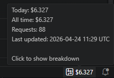

# Claude Cost Tracker

Shows your Claude API spending in the VSCode status bar, updated automatically after each response.



## How it works

```
Claude Code response
       │
       ▼
Stop hook fires
       │
       ▼
cost_tracker.py reads transcript JSONL
calculates cost by model & token type
writes → ~/.claude/cost_tracker.json
       │
       ▼
VSCode extension reads the file
updates status bar in real time
```

## Requirements

- Windows / macOS / Linux
- Python 3 (on Windows, `python` must be on `PATH`)
- VSCode or VSCode Insiders
- [Claude Code](https://claude.ai/code) CLI

## Installation

### Windows (PowerShell)

```powershell
git clone <repo-url>
cd ClaudeCost
./install.ps1
```

For VSCode Insiders instead of stable VSCode:

```powershell
./install.ps1 -Insiders
```

### macOS / Linux

```bash
git clone <repo-url>
cd ClaudeCost
./install.sh
```

Then **restart VSCode** (or VSCode Insiders). The cost tracker appears in the bottom-right status bar.

## Pricing

Costs are calculated using official Anthropic API prices per million tokens:

| Model | Input | Cache 5m write | Cache 1h write | Cache hit | Output |
|-------|------:|---------------:|---------------:|----------:|-------:|
| Claude Opus 4.7 / 4.6 / 4.5 | $5 | $6.25 | $10 | $0.50 | $25 |
| Claude Opus 4.1 / 4 / 3 | $15 | $18.75 | $30 | $1.50 | $75 |
| Claude Sonnet 4.6 / 4.5 / 4 / 3.7 | $3 | $3.75 | $6 | $0.30 | $15 |
| Claude Haiku 4.5 | $1 | $1.25 | $2 | $0.10 | $5 |
| Claude Haiku 3.5 | $0.80 | $1 | $1.6 | $0.08 | $4 |
| Claude Haiku 3 | $0.25 | $0.30 | $0.50 | $0.03 | $1.25 |

The model is detected automatically from the transcript — no configuration needed.

> **Note:** If you're on a Claude Pro / Max / Enterprise subscription, costs shown are the API-equivalent prices, not what you actually pay.

## Usage

- **Click** the status bar item to see a breakdown by day
- **Command palette** → `Claude Cost: Show Breakdown`
- **Command palette** → `Claude Cost: Reset Today's Counter`

## Files

| File | Description |
|------|-------------|
| `hooks/cost_tracker.py` | Claude Code Stop hook — runs after each response |
| `vscode-extension/extension.js` | VSCode extension — reads the JSON and shows status bar |
| `vscode-extension/package.json` | Extension manifest |
| `install.ps1` | One-command installer (Windows, supports `-Insiders`) |
| `install.sh` | One-command installer (macOS / Linux) |

## Data files

Two files are written to `~/.claude/`:

### `cost_tracker.json` — summary

Aggregated totals read by the VSCode extension:

```json
{
  "total_cost": 2.49,
  "total_requests": 74,
  "by_day":     { "2026-04-24": 2.49 },
  "by_project": { "ClaudeCost": 1.80, "other-repo": 0.69 },
  "by_model":   { "claude-opus-4-7": 2.10, "claude-sonnet-4-6": 0.39 },
  "last_updated": "2026-04-24 09:21 UTC"
}
```

### `cost_log.jsonl` — detailed log

One line per Claude response (append-only), useful for analytics or exporting to a spreadsheet:

```json
{"ts":"2026-04-24T09:21:03Z","date":"2026-04-24","session_id":"abc123","project":"ClaudeCost","cwd":"/path/to/ClaudeCost","model":"claude-opus-4-7","msg_id":"msg_01...","input_tokens":12,"output_tokens":340,"cache_read":8421,"cache_write_5m":1560,"cache_write_1h":0,"cost_usd":0.01234567}
```

Each record includes timestamp, project, model, token counts per type, and the exact cost in USD.

## Uninstall

### Windows (PowerShell)

```powershell
Remove-Item -Recurse -Force "$env:USERPROFILE\.vscode\extensions\claude-cost-tracker-0.1.0"
# For Insiders:
# Remove-Item -Recurse -Force "$env:USERPROFILE\.vscode-insiders\extensions\claude-cost-tracker-0.1.0"
Remove-Item "$env:USERPROFILE\.claude\hooks\cost_tracker.py"
Remove-Item "$env:USERPROFILE\.claude\cost_tracker.json"
Remove-Item "$env:USERPROFILE\.claude\cost_log.jsonl"
# Then remove the "hooks" block from %USERPROFILE%\.claude\settings.json
```

### macOS / Linux

```bash
rm -rf ~/.vscode/extensions/claude-cost-tracker-0.1.0
rm ~/.claude/hooks/cost_tracker.py
rm ~/.claude/cost_tracker.json
rm ~/.claude/cost_log.jsonl
# Remove the "hooks" block from ~/.claude/settings.json
```
